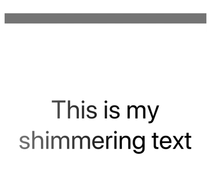

# ShimmerSwift
A swift implementation of Facebooks shimmer effect.

## ✅ Requirements
- Swift 5.1+
- iOS 9.0+

## 👨‍💻 Installation

#### Manual
Download the .zip from this repo and drag the Shimmer folder into your project.

#### Carthage
Add `github "BeauNouvelle/ShimmerSwift"` to your Cartfile.

#### Cocoapods
Add  `pod 'ShimmerSwift'` to your Podfile.

#### SPM
In Xcode 11 you can add packages by going to `File > Swift Packages > Add Package Dependency`. Copy in this repos URL and go from there.

## 👩‍🍳 Useage
Shimmer is super easy to get started with. 

Simply create a `ShimmeringView` or `ShimmeringLayer` and add your content.

    // Setup ShimmeringView
    let shimmerView = ShimmeringView(frame: self.view.bounds)
    self.view.addSubview(shimmerView)

    // Setup the view you want shimmered
    let label = UILabel(frame: shimmerView.bounds)
    label.text = "This is my shimmering text"

    // Add the view you want shimmered to the `shimmerView`
    shimmerView.contentView = label
    
    // Start shimmering
    shimmerView.isShimmering = true
    
    // To stop shimmering.
    shimmerView.isShimmering = false

### 👩‍🎨 Customization
All customizable properties are well documented in code, and are reproduced below.

----

##### contentView
The content view to be shimmered

    contentView: UIView

----

##### isShimmering
Set to `true` to start shimmer animation, and `false` to stop. Detaults to `false`.

    isShimmering: Bool
    
----

##### shimmerSpeed
The speed of the shimmer animation in points per second. The higher the number, the faster the animation.

Defaults to `230`.

    shimmerSpeed: CGFloat
    
----
   
##### shimmerHighlightLength

The highlight length of the shimmer. Range of [0,1], defaults to `1.0`.

    shimmerHighlightLength: CGFloat
    
----

##### shimmerDirection
    
The direction of the shimmer animation.
Defaults to `.right`, which will run the animation from left to right.
    
    shimmerDirection: Shimmer.Direction
    
----
##### shimmerPauseDuration

The time interval between shimmers in seconds.
Defaults to 0.4.
    
    shimmerPauseDuration: CFTimeInterval
    
----

##### shimmerAnimationOpacity

The opacity of the content during a shimmer. Defaults to `0.5`.

    shimmerAnimationOpacity: CGFloat
    
----

##### shimmerOpacity

The opacity of the content when not shimmering. Defaults to `1.0`.
    
    shimmerOpacity: CGFloat
    
----

##### shimmerBeginFadeDuration

The duration of the fade used when the shimmer begins. Defaults to `0.1`.

    shimmerBeginFadeDuration: CFTimeInterval
    
----

##### shimmerEndFadeDuration

The duration of the fade used when the shimmer ends. Defaults to `0.3`.

    shimmerEndFadeDuration: CFTimeInterval
